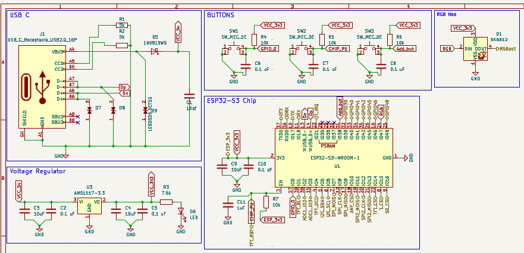
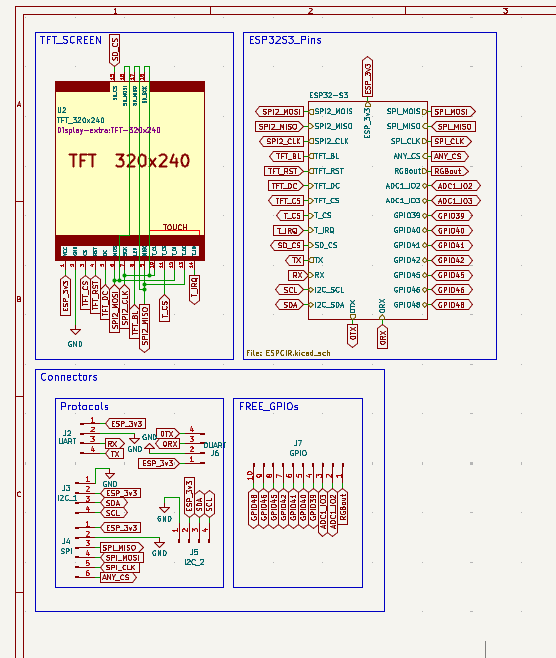
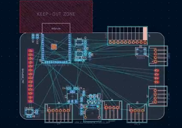
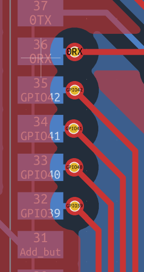
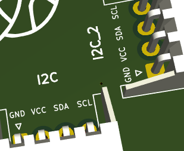
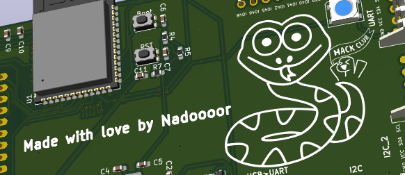

# SnakeCYD (Journal)
## Description:
SnakeCYD is a custom CYD, all in an PCB with snake slickscreen and with ESP32-s3 instead of a regular ESP32 chip.

## Entry 1
- Date 29/08/2026

### Content:
uhh this would take too long to write

ok i'll try my best

Hmm, well i decided to make a CYD clone with my changes and with an ESP32-s3 instead of the regular one, So i started by making my mind map and think about all the things i can add, 

All the things even if i will add them in different versions not only the first version.

and i got many, so i made some of them in this version

Well starting with the schematic ofcourse.

Well, in this time i wanted to learn how to use more than one Schematic page.

So i decided to make all the PCB in a page, and the other things like the display and the connectors in a page.

Starting with the ESP32-s3 page, i searched the internet and found a blog or artical talking about making a custom ESP32.

So i found the scchemtic in it and found the important parts and found that i don't need to make the Programmer circuit as the ESP32 has a built in USB and programmer.

So i only made the USB type C connector along the Voltage regulation circuit and the buttons and the chip itself.

and ended up with this.     
 
 
and yeah i also added the neo pixel and connected its Dout to to a free pin so i can take the data from it to any other neo strip.

After making this ESP32-s3 circuit i went to the other page and added the connectors and also the TFT itself.

And then gave each one's pins global labels.

and after finished them. i went to the ESP page and started making many page labels so i can take these pins out of the page to the main page where the connectors and the TFT.

And i ended up making the main page like this. 

After that, i finished all the schematic, but yeah i found a problem while iam making the TFT, well i mistakenly saw an arduino circuit connected to this TFT module, but it had many pull resistors which i don't need with ESP, so i removed them again.

After that i assigned all the components to the right footprints, i found them all in kicad but one footprint, which was the LESD5D5.0CT1G, so i downloaded it and added it.

After that, i went to the PCB desinging.

And got the screen and centered it and drew a rectangle around it that is 3mm bigger than it.

i then rounded the corners and started spreading out all the components in good places relativly to each other. like the voltage regulation circuit near the Type C and so on.

And i got it like that.

I then traced some of the components but i need to sleep so i closed the recording and said to continue atfter i wake up.
## Recording link:
https://lapse.hackclub.com/timelapse/Q-Om9-Dlgel0

## Entry 2
- Date: 31/08/2026

### Content:

Iam back, i had to go to somewhere yesterday so i didn't work.

but hey i ended it all now.

OK, i started tracing all the remaining components, well iam gonna to say two things i made while iam tracing which was so funny and i liked them

First i tried to trace all the SMD compnents from the back side so i can leave space for all the THT components from the top side and this was the best thing i've ever thinked about.

it was so easier to trace the THT from the Top layer instead of thet bottom.

to achieve that with the ESP32 smd chip, i made vias beside all the pins i need to connect the THT components to. so it ended up like this.

and also when ever i meet a trace that i need to walk through it, i made like briges for it like that.

after finishing that all, i started writing the pin out on all the connnectors so it can be easy for anyone to understand.

And also added my touch to it, like my Snake silkscreen and "Made with Love by Nadoooor"

And yeah that's it, i finished all the PCB, and also exported it to gerber files.

### Recording link:
https://lapse.hackclub.com/timelapse/JCPJE0gUIzQD

## Thanks so much for reading this, bro. ❤️