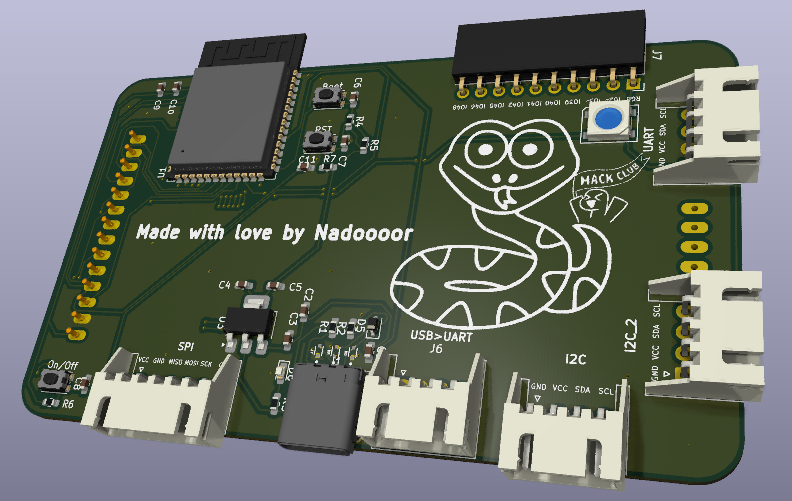
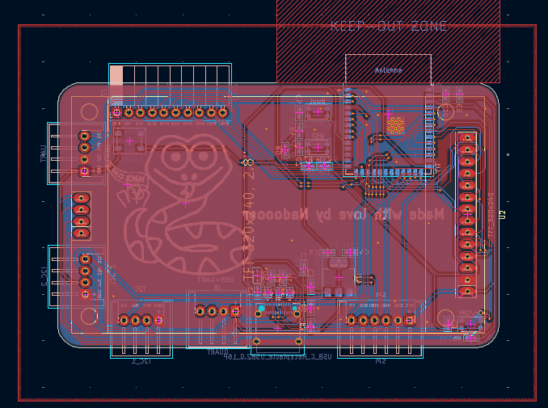
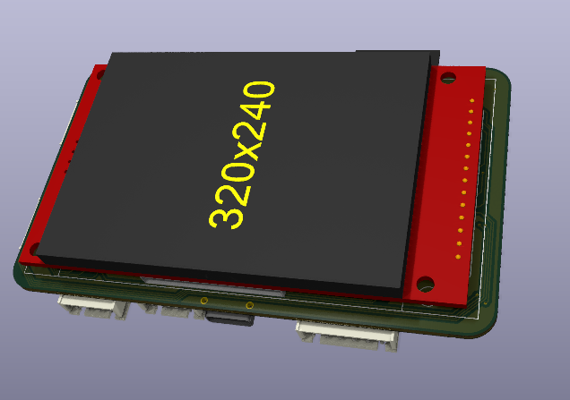

# SnakeCYD
--------------

--------------------------------

## Description:
SnakeCYD is a custom CYD, all in an PCB with snake slickscreen and with ESP32-s3 instead of a regular ESP32 chip.

## Why iam making this:
I was planning to get a CYD, but I got to know that it has a regular ESP32 on it instead of the S3, so i decided to make my own and add my snake slikscreen and also added bigger connectors for the wiring protocols and also some free pins.

## Featrues:

* Big JST connectors
* Free GPIO with PinSockets
* USB Type C
* Onboard Neopixel
* ESP32-S3 chip inside.

## Photos:

### PCB:

### 3D PCB:

### Schematic:
#### First Page:
--------------------

----------------------------
#### Second Page:

## Pinout:
| ESP32-S3 Pin Label | Signal / Net Name |
| :--- | :--- |
| **IO1** | `TFT_BL` |
| **IO4** | `TFT_DC` |
| **IO5** | `I2C_SDA` |
| **IO6** | `I2C_SCL` |
| **IO7** | `SPI_MOIS` |
| **IO8** | `SPI_CLK` |
| **IO9** | `SPI_MISO` |
| **IO10** | `ANY_CS` |
| **IO11** | `SPI2_MOIS` |
| **IO12** | `SPI2_CLK` |
| **IO13** | `SPI2_MISO` |
| **IO14** | `TFT_CS` |
| **IO15** | `T_CS` |
| **IO16** | `SD_CS` |
| **IO17** | `TX` |
| **IO18** | `RX` |
| **IO21** | `T_IRQ` |
| **TXD0** | `0TX` |
| **RXD0** | `0RX` |

## How to use:
1. Connect the SnakeCYD to you PC/Laptop.
2. Download the firmware source code you want to use.
3. Edit the pinout using the table above.
4. Build the firmware and flash it.
5. Enjoy.

## How to build:
1. Print the board.
2. Assemble all the components.
3. Enjoy.

# Made with ❤️, By Nadoooor